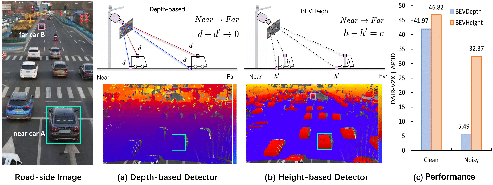

## BEVHeight
BEVHeight is a new vision-based 3D object detector specially designed for roadside scenario. please refer to our [paper on Arxiv](https://arxiv.org/abs/2206.10092).



## Quick Start
### Recommended docker image
```shell
docker pull yanglei2024/op-bevheight:base
```

### Installation
**Step 0.** Install [pytorch](https://pytorch.org/)(v1.9.0).

**Step 1.** Install [MMDetection3D](https://github.com/open-mmlab/mmdetection3d)(v0.18.1).

**Step 2.** Install requirements.
```shell
pip install -r requirements.txt
```
**Step 3.** Install BEVHeight(gpu required).
```shell
python setup.py develop
```

### Data preparation
**Step 0.** Download DAIR-V2X-I official dataset.

**Step 1.** Symlink the dataset root to `./data/`.
```
ln -s [single-infrastructure-side root] ./data/dair-v2x
```
The directory will be as follows.
```
BEVHeight
├── data
│   ├── dair-v2x
│   │   ├── velodyne
│   │   ├── image
│   │   ├── calib
│   │   ├── label
|   |   ├── data_info.json
```
**Step 2.** Prepare infos.
```
python scripts/gen_info_dair.py
```
**Step 3.** Prepare depth gt.
```
python scripts/gen_depth_gt_dair.py
```

### Tutorials
**Train.**
```
python [EXP_PATH] --amp_backend native -b 8 --gpus 8
```
**Eval.**
```
python [EXP_PATH] --ckpt_path [CKPT_PATH] -e -b 8 --gpus 8
```


## Cite BEVHeight
If you use BEVHeight in your research, please cite our work by using the following BibTeX entry:

